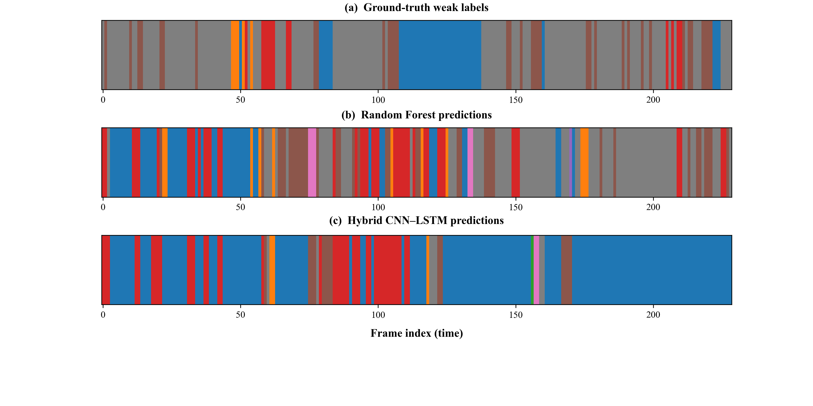

# 🧠 Temporal Modelling and Classification of Hand Flapping Form in Autism Spectrum Disorder

This repository implements a **pose-based deep learning framework** to classify **hand-flapping forms** in children with Autism Spectrum Disorder (ASD).  
It extends the earlier frequency-based pipeline by **Mohammed (2023)** to include **temporal modelling** and **form classification**, using pose-estimated joint angles and hybrid deep-learning architectures.

---

## 📖 Overview

Hand flapping is a common repetitive behaviour in ASD.  
While earlier methods quantified only **flapping frequency**, this study introduces a system to classify **flapping form**—including **symmetry**, **amplitude**, and **hand dominance**—using upper-limb kinematic features extracted from video.

### 🔍 Eight-Class Form Definition

| Class | Description |
|-------|--------------|
| 0 | No flap |
| 1 | Left-only (low amplitude) |
| 2 | Left-only (high amplitude) |
| 3 | Right-only (low amplitude) |
| 4 | Right-only (high amplitude) |
| 5 | Both symmetric (low amplitude) |
| 6 | Both symmetric (high amplitude) |
| 7 | Both asymmetric |

---

## 🧩 Pipeline Overview


---

## ⚙️ Methodology

### 1️⃣ Pose Extraction and Feature Computation
- Extract 33 landmarks using **MediaPipe Pose**
- Compute 8 joint angles (shoulder–elbow–wrist–hip)
- Derive first- and second-order temporal differences (Δ, Δ²)
- Final input tensor: `64 × 24` features per sequence

### 2️⃣ Models Implemented
| Model | Type | Notes |
|--------|------|-------|
| Random Forest | ML baseline | Best static accuracy |
| SVM | ML baseline | Sensitive to scaling |
| CNN1D | DL | Captures local temporal patterns |
| Bi-LSTM | DL | Captures long-range dependencies |
| **Hybrid CNN–LSTM** | DL | Combines both spatial and temporal dynamics |

### 3️⃣ Training Setup
| Parameter | Value |
|------------|--------|
| Loss | Categorical Cross-Entropy |
| Optimiser | Adam |
| Epochs | 50 |
| Batch Size | 32 |
| Cross-validation | Group K-Fold (per video) |

---

## 📊 Experimental Results

| Model | Accuracy | Macro-F1 | Observation |
|--------|-----------|-----------|-------------|
| Random Forest | **0.984 ± 0.013** | **0.943 ± 0.045** | Highest static accuracy |
| CNN1D | 0.842 ± 0.052 | 0.581 ± 0.041 | Learns local motion patterns |
| Bi-LSTM | 0.813 ± 0.041 | 0.569 ± 0.033 | Learns long-term dynamics |
| **Hybrid CNN–LSTM** | **0.855 ± 0.030** | **0.603 ± 0.026** | Best generalisation and interpretability |

> The hybrid CNN–LSTM demonstrated the most balanced performance among deep models, integrating both spatial and temporal representations.

---

## 🧮 Repository Structure

```
src/
 ├── preprocessing/       # Pose extraction, angle computation
 ├── training/            # ML and DL training scripts
 ├── inference/           # Predict and visualise results
 ├── analysis/            # Quantitative & qualitative evaluation
 └── utils/               # Helper functions and configs
configs/
 └── train_hybrid_len64.json
figures/
 ├── pipeline.png
 └── Figure_4_4_alignment.png
requirements.txt
README.md
.gitignore
LICENSE
weak_labels.csv (optional)
```

---

## 💻 Example Usage

### ▶️ Preprocess video
```bash
python src/preprocessing/extract_pose.py \
  --input data/raw_videos \
  --output data/landmarks
```

### 🧠 Train hybrid model
```bash
python src/training/train_hybrid.py \
  --config configs/train_hybrid_len64.json
```

### 🔍 Run inference
```bash
python src/inference/run_inference.py \
  --video Flapping_her_arms_KPuLA5LlVjg.mp4 \
  --model runs_dl/hybrid_len64_clean_finetune \
  --output figures/Figure_4_4_alignment.png
```

---

## 📈 Visual Examples

- **Pipeline Diagram:**  
  

- **Prediction Alignment (Fig. 4.4):**  
  

---

## 🧭 Citation

If you use this code, please cite:

> Chen, S. (2025). *Temporal Modelling and Classification of Hand Flapping Form in Autism Spectrum Disorder.*  
> Master’s Dissertation, University of Malaya.

and prior work:

> Mohammed, H. A. (2023). *Hand Flapping Detection Using Pose Estimation.*  
> University of Malaya.

---

## 🪄 Acknowledgements

This project extends the baseline framework of **Mohammed (2023)** and was supervised by **Dr. Zati Hakim Azizul Hasan**  
at the Department of Artificial Intelligence, Faculty of Computer Science and Information Technology, Universiti Malaya.

---

## 🧩 License

This repository is distributed under the **MIT License**.  
Raw video data from the **ASBD dataset** is not redistributed here due to privacy and licensing constraints.  
Processed features and trained models are available upon reasonable request.

---

## 🌍 Keywords

`Autism Spectrum Disorder` • `Hand Flapping` • `Pose Estimation` • `Deep Learning` • `CNN–LSTM` • `Temporal Modelling` • `Computer Vision`
